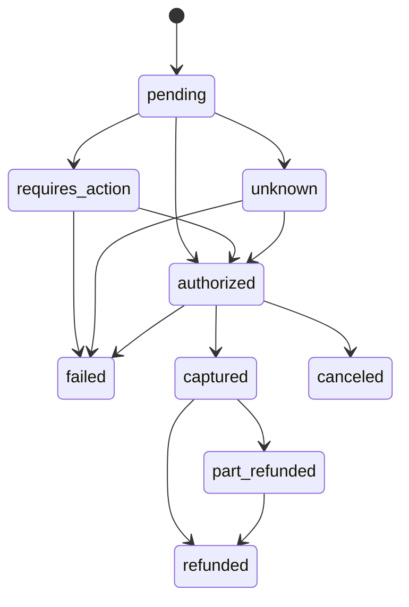
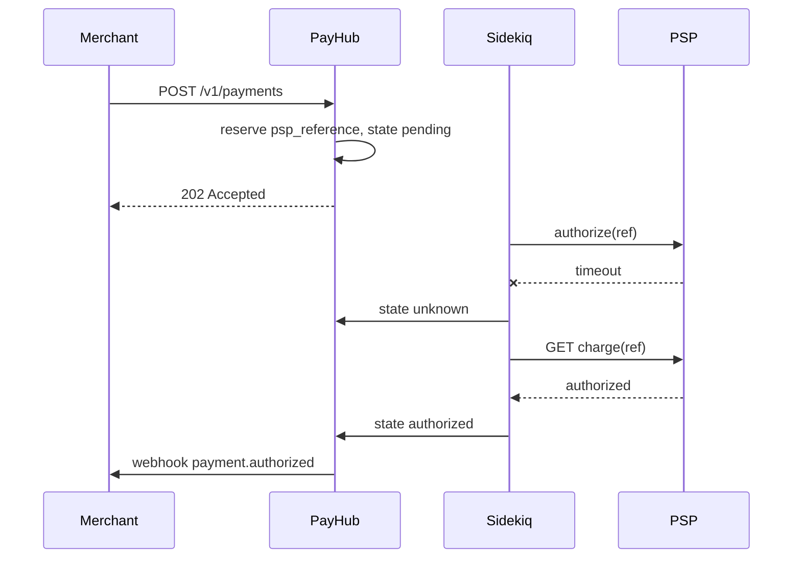

# PayHub

## Context

PayHub is a payment orchestration API. Merchants integrate once with PayHub; PayHub routes each payment to one of several downstream payment service providers (PSPs) and gives the merchant a single, consistent view of money movement.

You are building the core service. Two PSPs are provided as simulators, both deliberately unreliable: they time out, return duplicate responses, send webhooks out of order, and occasionally never send a webhook at all. Your service must stay correct anyway.

## The one rule that matters

> **No customer is ever charged twice, and no merchant is ever refunded more than they captured** — under network timeouts, duplicate webhooks, concurrent requests, worker crashes, and PSP outages.

Every design decision in this exercise exists to serve that rule. If you have to trade off elegance against that rule, the rule wins, and you write down why in `DECISIONS.md`.

### In scope

- Merchant-facing REST API for payments, captures, refunds, and payment methods.
- Payment lifecycle across two PSP adapters, selected by a routing rule.
- Multi-currency with minor units and a snapshotted FX rate.
- Idempotent writes, background processing, inbound and outbound webhooks.
- An append-only double-entry ledger and a daily reconciliation job.
- Structured logs, metrics, a health endpoint, and an operator runbook.

### Out of scope

- Any UI. `curl` and RSpec are the whole interface.
- Real PSP credentials, real card numbers, real PCI certification.
- Chargebacks, disputes, payouts, and settlement banking.
- Kubernetes, Terraform, or a production deploy. `docker compose up` is enough.

### Deliverables

- A Rails repository that boots with `docker compose up` and one seed command.
- `README.md`: how to run it, and a 10-line tour of the domain model.
- `DECISIONS.md`: 8 to 12 short entries, each stating a decision, the alternative rejected, and the reason.
- `RUNBOOK.md`: how an on-call engineer diagnoses a stuck payment at 3am.
- A test suite that passes the scenarios in the section below.

## Domain model and schema

The payment state machine is the spine of the system. Every other table hangs off it.



`unknown` is the state most candidates forget. A payment enters it when the PSP call times out, and only the status-poller job or a late webhook can move it out.

### Tables

| Table | Key columns | Constraint that must exist |
| --- | --- | --- |
| `merchants` | `api_key_digest`, `webhook_secret`, `default_currency` | Unique index on `api_key_digest` |
| `payments` | `merchant_id`, `amount_minor`, `currency`, `state`, `psp_name`, `psp_reference`, `lock_version` | Unique on `(psp_name, psp_reference)`; check `amount_minor > 0` |
| `payment_transitions` | `payment_id`, `to_state`, `sort_key`, `metadata jsonb`, `most_recent` | Unique partial index on `(payment_id)` where `most_recent` |
| `refunds` | `payment_id`, `amount_minor`, `state`, `psp_reference` | Sum of succeeded refunds must not exceed captured amount |
| `idempotency_keys` | `merchant_id`, `key`, `request_fingerprint`, `response_body`, `locked_at`, `expires_at` | Unique on `(merchant_id, key)` |
| `ledger_accounts` | `merchant_id`, `kind`, `currency` | Unique on `(merchant_id, kind, currency)` |
| `ledger_entries` | `transfer_id`, `account_id`, `direction`, `amount_minor` | Append-only; entries of one `transfer_id` sum to zero per currency |
| `inbound_events` | `psp_name`, `external_id`, `payload jsonb`, `processed_at`, `signature_valid` | Unique on `(psp_name, external_id)` |
| `outbound_events` | `merchant_id`, `event_type`, `payload`, `attempts`, `next_attempt_at`, `state` | Index on `(state, next_attempt_at)` for the delivery sweeper |
| `fx_rates` | `base`, `quote`, `rate`, `captured_at` | Rate is copied onto the payment, never joined at read time |

### Rules the schema must enforce

- Amounts are integers in minor units, plus an ISO-4217 currency column. No float, no decimal without a currency next to it.
- `ledger_entries` has no `updated_at` for a reason: nothing in it is ever changed. Corrections are new reversing entries.
- A payment row stores `psp_reference` as soon as the PSP call is *sent*, not when it returns. Otherwise a timeout leaves you unable to look the charge up.

## API contract

Authentication is a bearer API key per merchant, compared against a digest with a constant-time check. Every `POST` requires an `Idempotency-Key` header and returns `400` without one.

| Method | Path | Notes |
| --- | --- | --- |
| `POST` | `/v1/payments` | Creates and authorizes. Body: `amount_minor`, `currency`, `payment_method_token`, `capture` (bool), `metadata` |
| `GET` | `/v1/payments/:id` | Includes current state and the transition history |
| `POST` | `/v1/payments/:id/capture` | Partial capture allowed; amount defaults to the authorized amount |
| `POST` | `/v1/payments/:id/cancel` | Only valid from `authorized` |
| `POST` | `/v1/payments/:id/refunds` | Partial and repeated refunds allowed up to the captured amount |
| `GET` | `/v1/payments` | Cursor pagination, filters on `state`, `currency`, `created_at` range |
| `GET` | `/v1/balance` | Derived from the ledger, per currency |
| `POST` | `/v1/webhooks/:psp_name` | Inbound from the PSP simulators; unauthenticated but signature-verified |
| `GET` | `/v1/events` | Outbound events and their delivery attempts |
| `POST` | `/v1/events/:id/redeliver` | Operator replay from the dead-letter state |
| `GET` | `/healthz` and `/metrics` | Liveness and Prometheus-style counters |

### Error shape

Every non-2xx response uses one shape, and the `type` field tells the client whether retrying is safe.

```json
{
  "error": {
    "type": "card_error | invalid_request | api_error | rate_limit | idempotency_error",
    "code": "insufficient_funds",
    "message": "The card was declined.",
    "param": "amount_minor",
    "retriable": false,
    "request_id": "req_01HX..."
  }
}
```

### Rules

- `POST /v1/payments` returns `202` with state `pending` when the work is queued, never blocks on the PSP for more than 3 seconds.
- A replayed idempotency key returns the original status code and body, plus an `Idempotent-Replayed: true` header.
- Cursor pagination returns `data`, `has_more`, and `next_cursor`. The cursor encodes `(created_at, id)` and is opaque to the client.
- Validation errors return `422` with *every* failing field at once, not the first one.

## The two PSP simulators

Build both as small Sinatra or Rails apps in the same compose file. They must differ in semantics, not just in URL, or your adapter abstraction will be fake.

| | Nordpay | Kiripay |
| --- | --- | --- |
| **Region and method** | EU cards | SEA e-wallets |
| **Currencies** | EUR, GBP, USD | VND, THB, IDR |
| **Auth model** | Separate authorize then capture | Capture-only, no auth step |
| **Confirmation** | Synchronous response | Redirect, then webhook only |
| **Zero-decimal currency** | No | Yes, VND has no minor unit |
| **Refunds** | Partial allowed | Full refund only |
| **Idempotency** | Honours an `X-Request-Id` header | None, so you must dedupe yourself |

The semantic gap is the point. Kiripay having no authorize step and no partial refund forces your domain model to be richer than any single PSP.

### Failure injection

Each simulator reads a config file and injects these behaviours at a configurable rate.

| Behaviour | What the system must do |
| --- | --- |
| Request times out after 30s, but the charge succeeded | Move to `unknown`, poll status, never retry blindly |
| Returns 500 on the first attempt, 200 on the second | Retry with backoff; the retry must carry the same reference |
| Returns the same charge twice for one request | Dedupe on `psp_reference`, do not create a second payment |
| Sends `charge.captured` before `charge.authorized` | Ignore stale transitions; order by the PSP's own timestamp |
| Sends the same webhook five times | Unique index on `(psp_name, external_id)` makes it a no-op |
| Sends a webhook 6 hours late | Still apply it if the state machine allows; log the lag |
| Never sends a webhook | The sweeper job must catch it by polling |
| Signs a webhook with the wrong secret | Reject with `401`, store it, alert; never process |
| Returns HTTP 200 with `"status": "declined"` | Success at the transport layer is not success at the domain layer |

### The timeout flow you will be asked to draw on a whiteboard



## Non-functional requirements

This is the half of the JD that most candidates skip, and it is where a senior answer separates itself.

### Observability

- One JSON log line per request and per job, carrying `request_id`, `merchant_id`, `payment_id`, `psp_name`, and duration in ms. A single `grep` on `payment_id` must reconstruct the whole life of a payment across web and worker.
- Counters for `payments_created`, `psp_calls` by outcome, `webhook_deliveries` by attempt number, `unknown_state_payments`, and `ledger_imbalance_detected`.
- One alert that would actually page someone: any payment stuck in `pending` or `unknown` for more than 15 minutes.

### Security and PCI awareness

- The service never accepts a raw card number. The API takes a token only, and the README explains where tokenization would happen in a real system.
- `config.filter_parameters` redacts `card`, `cvv`, `number`, `token`, `authorization`, and `signature`. Prove it with a test that asserts a PAN-shaped string never reaches the log.
- Webhook signature comparison uses `ActiveSupport::SecurityUtils.secure_compare`. API keys are stored as digests, shown to the merchant once.
- Rate limit per merchant with `Rack::Attack`, and return `429` with `Retry-After`.

### Performance

- `GET /v1/payments` stays under 100ms at 1,000,000 rows. Seed that many and prove it with `EXPLAIN ANALYZE` pasted into the README.
- Every query in the hot path uses an index. The compound index on `(merchant_id, created_at DESC, id DESC)` is the one the cursor needs.
- No N+1 in the payment list endpoint. Add the `prosopite` or `bullet` gem in test mode and fail the suite on a violation.

### Testing

- Request specs for every endpoint, including the unhappy paths.
- Job specs that assert idempotency by invoking `perform` twice and checking the ledger is unchanged.
- At least two concurrency tests using real threads and a real database connection, not mocks.
- A property-style test: for any sequence of capture and refund calls, the ledger sums to zero and the refunded total never exceeds the captured total.
