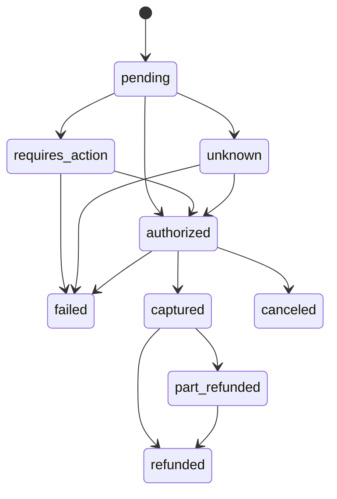

# PayHub

A payment orchestration API. Merchants integrate once; PayHub routes each payment to one of two deliberately unreliable PSP simulators and keeps one consistent view of money movement.

**The one rule:** no customer is ever charged twice, and no merchant is ever refunded more than they captured — under timeouts, duplicate webhooks, concurrent requests, worker crashes and PSP outages. Every design choice serves it; [DECISIONS.md](DECISIONS.md) records the twelve that mattered, and [RUNBOOK.md](RUNBOOK.md) is what you read at 3am.

## Run it

```bash
docker compose up --build          # postgres, redis, web (:3000), worker, nordpay (:4001), kiripay (:4002)
docker compose exec web bin/rails db:prepare db:seed   # schema + FX table + a demo merchant (prints its API key ONCE)
```

Then, with the key the seed printed:

```bash
export KEY=sk_live_…
curl -s -X POST localhost:3000/v1/payments \
  -H "Authorization: Bearer $KEY" -H "Idempotency-Key: $(uuidgen)" -H 'Content-Type: application/json' \
  -d '{"amount_minor":2500,"currency":"EUR","payment_method_token":"tok_visa"}'
# → 202 {"state":"pending", …}   the PSP call happens in the worker
curl -s localhost:3000/v1/payments/<id> -H "Authorization: Bearer $KEY"
# → {"state":"authorized", "transitions":[…]}   one time in ten: pending → unknown → authorized (see below)
```

A Kiripay (SEA wallet) payment stops at `requires_action` with a redirect URL until the "customer" approves — simulate that with `curl -X POST localhost:4002/_sim/charges/<kp_id>/approve`; the simulator then delivers signed webhooks and the payment becomes `captured`.

**Port 3000 taken?** `WEB_PORT=3100 docker compose up`. **Kiripay webhooks not arriving when Rails runs outside compose?** set `PAYHUB_WEBHOOK_URL=http://host.docker.internal:3000/v1/webhooks/kiripay` on the simulator. **Puma says "a server is already running"?** the compose command already removes the stale pid; if you run `bin/rails s` yourself, `rm tmp/pids/server.pid`.

### Local development (Rails on the host, databases in Docker)

```bash
docker compose up -d db redis nordpay kiripay   # postgres is on host port 5434 — 5432 is often taken
bin/rails db:prepare db:seed
bin/rails s                                     # and, in another shell:
bundle exec sidekiq -C config/sidekiq.yml
bin/check                                       # zeitwerk → rubocop → sorbet → rspec → brakeman; CI runs exactly this
```

Ruby 3.3.12 (`.ruby-version`), Rails 8.1, Postgres 16. Both PSP simulators are standalone Sinatra apps with their own `Gemfile` and specs (`cd simulators/nordpay && bundle exec rspec`).

## The domain in ten lines

1. A **payment** is a row whose `state` is a cache of its latest **transition**; transitions are append-only, ordered by the PSP's own timestamp (`sort_key`), and exactly one is `most_recent` (partial unique index).
2. `psp_reference` is generated by us and written **before** the PSP is called, so a timed-out charge can always be looked up.
3. A PSP timeout moves the payment to **`unknown`** — an honest "I don't know" — and the only exits are a status poll or a webhook. Nothing ever re-sends a charge it can't prove was lost.
4. Every `POST` carries an **Idempotency-Key**; the claim is an `INSERT` into a unique index, and the unique index — not a `SELECT` — decides who wins.
5. Money is integer **minor units** next to an ISO-4217 code; `Currency` is the only place that knows VND has none. The FX rate is copied onto the payment at creation, never joined.
6. The **ledger** is append-only double-entry: every movement is legs that sum to zero, a trigger rejects `UPDATE`/`DELETE`, and balances, captured and refunded totals are `SUM`s over rows.
7. Refunds are guarded by `FOR UPDATE` on the payment plus `captured − refunded (ledger) − pending (reservations)`; two racing refunds serialize on the lock.
8. **Adapters** (`Nordpay`, `Kiripay`) satisfy one abstract, Sorbet-checked contract and declare what they support; the domain never branches on a PSP's name.
9. Inbound **webhooks** are signature-verified with `secure_compare`, deduplicated by a unique index on the PSP's event id, and applied by PSP timestamp so out-of-order delivery cannot walk a payment backwards.
10. Outbound events are a **transactional outbox** written in the same transaction as the state change; a minute-sweeper delivers them with backoff, and a second sweeper polls anything stuck and pages after 15 minutes.

## Where tokenization would happen

This service never sees a card number. `payment_method_token` is opaque here. In a real deployment a separate, PCI-scoped tokenization service (or the PSP's hosted fields / client-side SDK) would receive the PAN directly from the customer's browser and return a token; PayHub's scope stays at SAQ-A level because the PAN never transits it. Defence in depth for the day a client sends one anyway: `filter_parameters` redacts `card`, `cvv`, `number`, `token`, `authorization`, `signature`, and every opaque blob column (`metadata`, `payload`, `response_body`) — and `spec/requests/v1/pan_never_logged_spec.rb` proves a PAN posted in any field never reaches the log. That test found two real leaks during development (jsonb binds at DEBUG level).

## The timeout flow, as it actually ran

From a live run against the Nordpay simulator with `timeout_rate: 1` (the simulator records the charge, then hangs 5s; our client gives up at 3s):

```
pending          -> unknown      worker   psp_ts=10.346  {"error":"Net::ReadTimeout","gave_up_at":"…13.351Z"}
unknown          -> authorized   worker   psp_ts=10.347  applied=true
```

`unknown` is dated from the moment we **sent** the request, not when we gave up — otherwise the PSP's genuine timestamp (1ms after receipt) looks older than ours and the poll result is discarded as stale. That bug was found by this exact run, not by the suite; DECISIONS #11.

## Performance: `GET /v1/payments` at one million rows

Cursor pagination is keyset on `(merchant_id, created_at DESC, id DESC)` — no `OFFSET`, no `COUNT`, `LIMIT n+1` to learn `has_more`. Seed and prove it yourself:

```bash
bin/rails "perf:seed[1000000]"   # one INSERT … SELECT generate_series; ~30s
bin/rails perf:explain           # EXPLAIN (ANALYZE, BUFFERS) of the exact page-2+ query
bin/rails perf:bench             # 20 runs, p50/p95
```

Output on a laptop (Postgres 16 in Docker), cursor positioned in the middle of the table:

```
payments: 1001008  merchant's: 1001007

Limit  (cost=0.42..5.35 rows=26 width=133) (actual time=0.061..0.333 rows=26 loops=1)
  Buffers: shared hit=12 read=23 written=19
  ->  Index Scan using idx_payments_cursor on payments  (cost=0.42..94653.31 rows=499316 width=133) (actual time=0.060..0.329 rows=26 loops=1)
        Index Cond: ((merchant_id = '…'::uuid) AND (ROW(created_at, id) < ROW('2026-08-08 08:30:39.41011', '01a0c84c-…'::uuid)))
Planning Time: 0.103 ms
Execution Time: 0.377 ms

p50=0.69ms  p95=1.21ms  max=2.17ms  (n=20, 1001008 rows)
```

The planner estimates 499,316 candidate rows and touches 35 buffers: the index carries it straight to the page. The list endpoint loads no transitions (`spec/requests/v1/payments_index_spec.rb` asserts exactly one `payments` query and zero `payment_transitions` queries).

## Observability

- **Logs**: one JSON line per request (lograge) and per job (`ApplicationJob`), both carrying `request_id`, `merchant_id`, `payment_id`, `psp_name`, `duration_ms`. Jobs inherit the enqueuing request's id, so `grep '"payment_id":"…"' log/*.log` reconstructs a payment's whole life across web and worker. Request bodies are never logged.
- **Metrics** (`GET /metrics`, Prometheus text): `payhub_payments_created_total{psp,currency}`, `payhub_psp_calls_total{psp,operation,outcome}`, `payhub_webhook_deliveries_total{attempt}`, `payhub_webhook_duplicates_total`, `payhub_webhook_signature_failures_total`, `payhub_stuck_payment_alerts_total`, `payhub_ledger_imbalance_detected_total`; gauges `payhub_unknown_state_payments`, `payhub_outbound_events_pending`, `payhub_outbound_events_dead`.
- **The alert that pages**: `event=alert.stuck_payment` at ERROR for any payment in `pending`/`unknown` past 15 minutes, raised by the minute-sweeper. Everything else is a dashboard.
- **Health**: `GET /healthz` checks the database only — a liveness probe that fails on a slow dependency causes restarts, not fixes.
- **Rate limit**: 300 requests/minute per merchant (bearer-key digest), `429` with `Retry-After` in the standard error shape.

## API

| Method | Path | Notes |
| --- | --- | --- |
| `POST` | `/v1/payments` | `202 pending`; body `amount_minor, currency, payment_method_token, capture, metadata` |
| `GET` | `/v1/payments/:id` | state + full transition history |
| `GET` | `/v1/payments` | cursor pagination; filters `state, currency, created_after, created_before` |
| `POST` | `/v1/payments/:id/capture` | partial allowed; `202` |
| `POST` | `/v1/payments/:id/cancel` | from `authorized` only; synchronous |
| `POST` | `/v1/payments/:id/refunds` | partial and repeated up to captured; `202` pending refund |
| `GET` | `/v1/balance` | per currency, from the ledger |
| `GET` | `/v1/events` | outbound events + delivery attempts; cursor |
| `POST` | `/v1/events/:id/redeliver` | replay a dead-lettered event |
| `POST` | `/v1/webhooks/:psp_name` | inbound from the simulators; signature-verified |
| `GET` | `/healthz`, `/metrics` | liveness; Prometheus |

Every non-2xx uses one shape: `{"error":{"type","code","message","param","retriable","request_id"}}`. `422` validation errors list **every** failing field under `details`. A replayed idempotency key returns the original status and body plus `Idempotent-Replayed: true`; the same key with a different body is `422 idempotency_error`; a key still in flight is `409` (retriable).

## The two PSP simulators

| | Nordpay (`:4001`) | Kiripay (`:4002`) |
| --- | --- | --- |
| Currencies | EUR, GBP, USD | VND, THB, IDR (VND has no minor unit) |
| Model | authorize, then capture; synchronous | capture-only; redirect, then **webhook only** |
| Refunds | partial | full only |
| Idempotency | honours `X-Request-Id` | none — we dedupe by our `merchant_reference` |
| Webhook signature | `X-Nordpay-Signature: <hmac-sha256 hex of body>` | `X-Kiripay-Signature: t=<unix>,v1=<hmac of "t.body">` |

Each reads `failure_config.yml` and misbehaves at the configured rate: 30s timeouts after recording the charge, `500` then `200`, the same charge twice in one body, `200` with `status: declined`, and webhooks that are duplicated ×5, reordered, hours late, mis-signed or never sent. Every behaviour can be forced per request with `X-Sim-Force: timeout,webhook_duplicate,…` so PayHub's specs are deterministic. Admin endpoints: `POST /_sim/reset`, `GET /_sim/charges`, `GET /_sim/webhooks`, `PUT /_sim/config`.

## Tests

`bin/check` runs the whole gate. Highlights the spec asks for:

- **Request specs for every endpoint**, including the unhappy paths.
- **Job specs that call `perform` twice** and assert the ledger is unchanged (`capture_payment_job_spec`, `refund_payment_job_spec`).
- **Real-thread concurrency tests** with real connections and no transactional fixture: N identical idempotency keys (one wins), N simultaneous refunds on one capture (one wins), three outbox sweepers over one queue (no double-send).
- **A property test**: 25 random capture/refund sequences against a PSP that always says yes — the ledger stays balanced, `refunded ≤ captured ≤ authorized`, balance = captured − refunded.
- **The state-machine spec parses the Mermaid diagram in this README** and fails if code and diagram drift beyond the one declared extra edge.
- **A PAN never reaches the log**, proven by capturing everything Rails logs during a request that carries one.

## Domain model



Plus one edge the diagram omits and the code adds deliberately: `pending → failed`, for a synchronous decline (DECISIONS #10). The schema with every constraint is in [docs/schema.dbml](docs/schema.dbml) — paste it into dbdiagram.io — and in `db/structure.sql`.

## Out of scope, on purpose

No UI. No real PSP credentials or card numbers. No chargebacks, disputes, payouts or settlement. No Kubernetes — `docker compose up` is the deployment. The production `Dockerfile` hardening (multi-stage, non-root, precompiled bootsnap) is noted, not done.

---

The original assignment brief this repository answers is preserved verbatim in [docs/ASSIGNMENT.md](docs/ASSIGNMENT.md).
